## Build and Deploy the Extension Application

In this section, you will clone the codebase and deploy the extension application in SAP BTP. 

### 1. Clone the GitHub Repository
    

Access the [Event To Action Framework](https://github.com/SAP-samples/btp-events-to-business-actions-framework) GitHub repository to download the project.

### 2. Check the Prerequisites for Deployment

Ensure you have added the required entitlements as described in section **Step1-Setup-SAPBTP-Subaccount** page before deployment.

### 3. Deploy the Extension Application

Build and deploy the application. Run the following commands:

**Note**: Ensure you have Cloud MBT Build Tool. Refer [The Cloud MTA Build Tool (MBT)](https://help.sap.com/docs/HANA_CLOUD_DATABASE/c2b99f19e9264c4d9ae9221b22f6f589/1412120094534a23b1a894bc498c2767.html) for more details.

1. Open the Cloud Foundry command line interface (cf CLI).

2. Navigate to **action-management** directory.

    ```
    cd action-management
    ```
3. Fetch the dependencies.

    ```
    npm install
    ```
4. Build action-management modules.

    ```
    npm run build
    ```
5. Log in to your subaccount in SAP BTP to deploy the extension application.
    Check your region and copy the API endpoint accordingly. For example, "https://api.cf.region.hana.ondemand.com"

    ```
    cf login -a `<CF API endpoint>`
    ```
6. Push the application to your subaccount.

    ```
    npm run deploy
    ```
7. You can also check the status of your applications in the SAP BTP cockpit. Copy the value of the extension application URL.

    

8. In the SAP BTP cockpit, navigate to your subaccount and choose **Services** > **Instances and Subscriptions**. Check if you have all of the instances created post deployment as shown below. Make sure the status of all of the instances are **Created**.

    

9. **SAP Integration Suite, Advanced Event Mesh Configuration**

    To access the SAP Integration Suite, Advanced Event Mesh, navigate to **Services** > and choose **Instances and Subscriptions**.
    Choose the row for the SAP Integration Suite, Advanced Event Mesh subscription and choose **Go to Application**

    

10. Choose **Cluster Manager** in the SAP Integration Suite, Advanced Event Mesh Application. 
    

11. Click on **Create Service**.

    
    
    Fill the **Service Name** as **PPE** and select **Service Type** as **Standard**. Select **Amazon Web Services** from the drop down menu for **Cloud**, Choose **Frankfurt** as **Region** from the Map, leave the prepopulated version for **Broker Version** , for this tutorial.

    Click on **Create Service**

    


12. Click on the created service **PPE**
    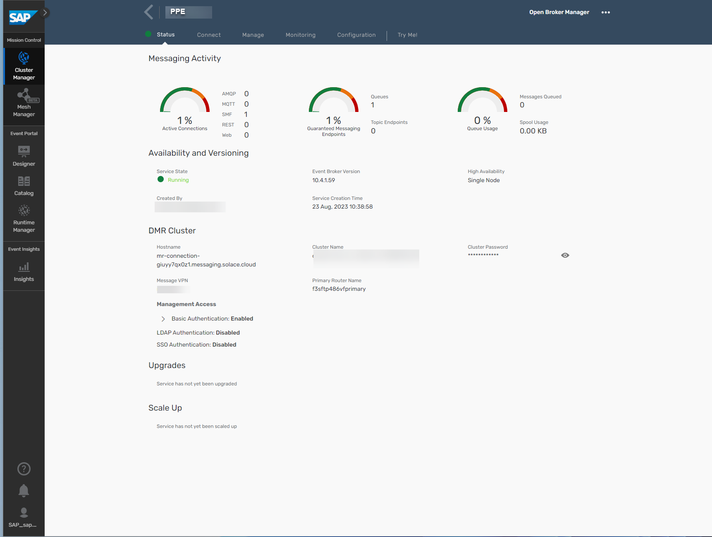

    Click on the **connect** tab and expand the **REST** tile to get the messaging connectivity information.

    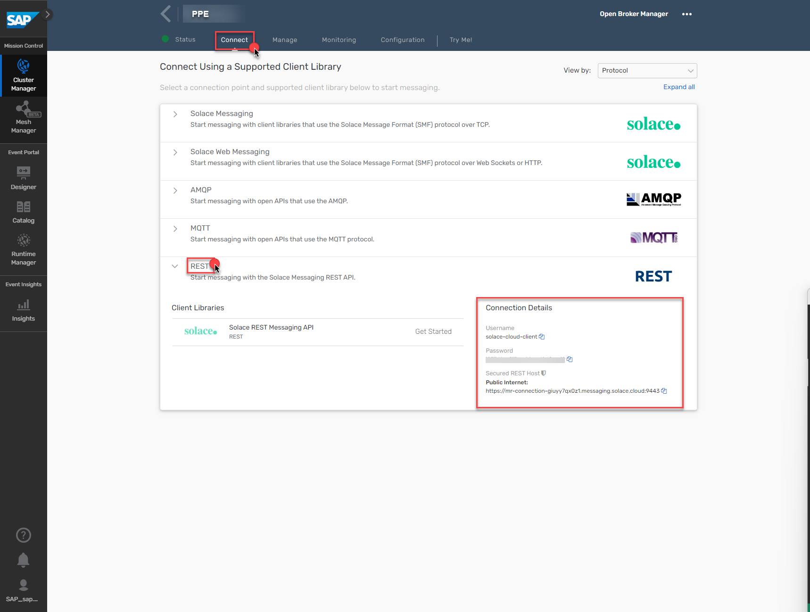

13. Configuring a **REST Delivery Point**
     Next, you must configure a queue and a REST delivery point on Message VPN.

     **a.** Click on **Open Broker Manager**.

     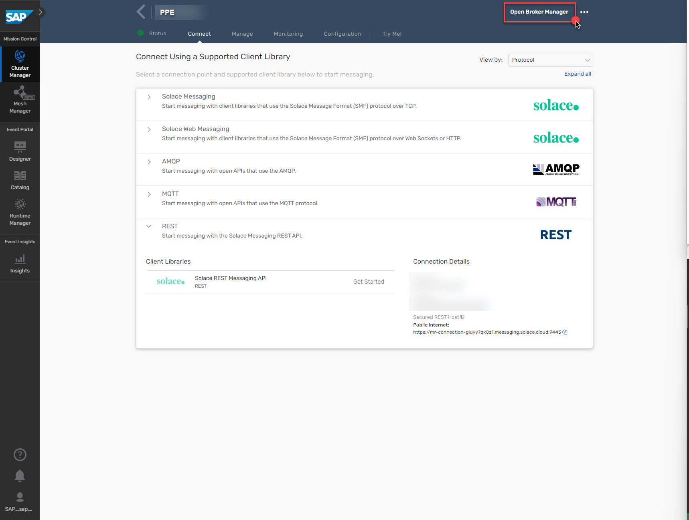

     **b.** The **Broker Manager** application loads. The next step is to create a queue, on the left pane click on **Queues**  
     

     **c.** Create a Queue by name **Q/rdp1/input**
     

     Enable both incoming and outgoing configuration
     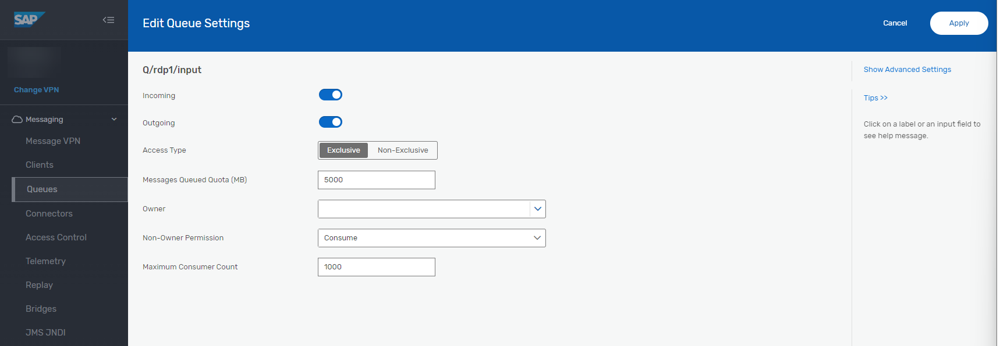    

     Queue successfully created
     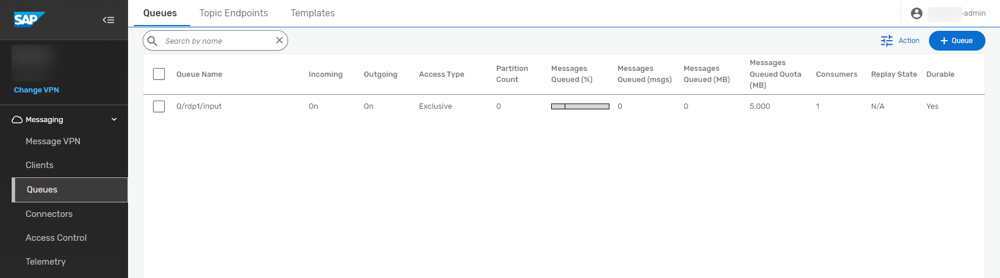    

     **d.** Add a **Topic Subscription** to the queue.

     Click on the queue created and then click on the **Subscriptions** Tab.

     Then click on **+ Subscription** to add a topic.
     

     In the **Create Subscription** screen, type in the topic name as **ppe/messages** and click **Create**
     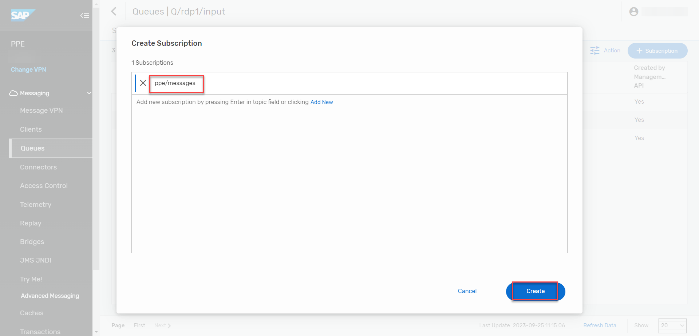    

     Topic Subscription successfully created. 
     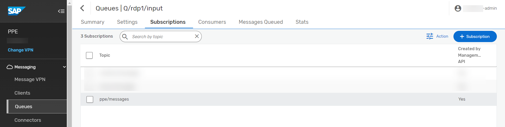

     **e.** Create a **REST Delivery Point** object

     On the left pane click on **Clients** and then Navigate to **REST** tab.
     

     Click on ** + REST Delivery Point** and Fill the **RDP Name** as **rdp1**
     

     Configure the REST Delivery Point
       

     REST Delivery Point successfully created
       

     **f.**  Create a Queue Binding object

     Create a queue binding to the queue you created previously. This will tell the RDP where to fetch messages from. **Note:** that REST Delivery Points (RDPs) can be bound to multiple queues.

     Click on the **rdp1** created in the previous step. Click on **Queue Bindings** Tab.

     

     Create a queue binding - **Q/rdp1/input**

     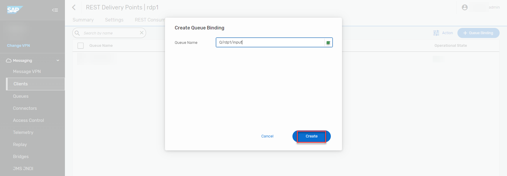

     Set the POST target where the requests would be sent - **/api/events**

     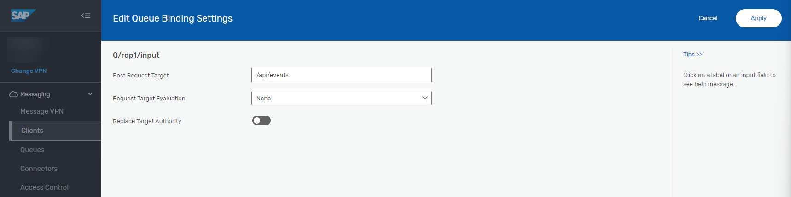

     **Note:** that the RDP is down - it will automatically start up when a REST consumer makes a connection to the RDP.

     

     **g.** Create a **REST Consumer** object.

     Navigate to **REST Consumers** Tab and click on **+ REST Conusmer**

     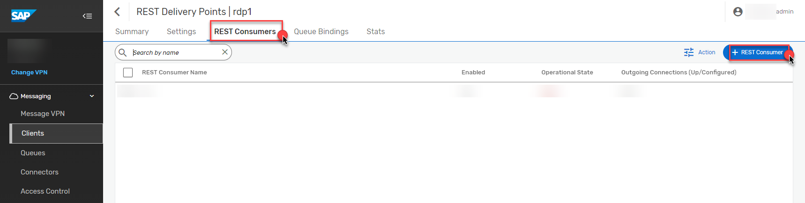

     Fill in the **REST Consumer Name** as **rc1** 

     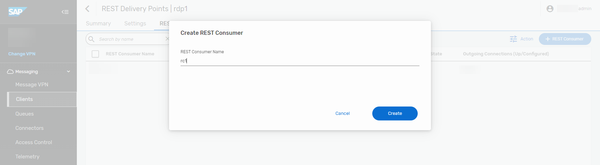

     Enable the **REST Consumer** and set HOST:PORT details of the message HTTP listener. 

     To Fill the **Host** , Navigate to the Cloud Foundary Space where the application is deployed and Click on **action-management-srv**.

     

     Copy the link under **Application Routes**,. **Note:** Strip the **https://** before pasting the value in the **Host** field

     

     Fill in the Value of **Port** as **443**

     Select **POST** as the **HTTP Method**.

     Enable the TLS.

     Keep **Outgoing Connection Count** value as **1**.

     Fill the **Max Response Wait Time (sec)** as **30**

     Populate **Connection Retry Delay (sec)** field with **300**

     From the drop down menu, choose **OAuth 2.0 Client Credentials** as the **Authentication Scheme**.

     Next, Go to your **BTP subaccount** ,Navigate to **Services** > **Instances and Subscriptions** and under the **Instances** select **action-management-auth**.

     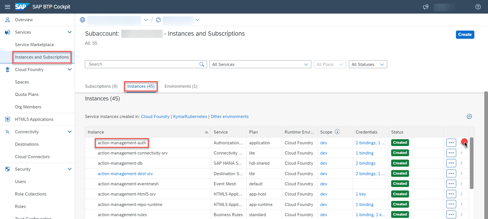

     Under the **Service Keys** the key named **action-management-auth-key** is already created. Click on the **View** Option to get the **OAuth 2.0 Client Credentials**.  

     

     Copy the **clientid**, **clientsecret** and **url**. Navigate back to the **REST Consumer** configuration and paste the values for **Client ID** and **Client Secret**. Paste the **url** copied earlier in the **Token Endpoint URL** and appened **/oauth/token** at the end of the **url**. 
     Effective **Token Endpoint URL** is **url/oauth/token**.

     Fill the remaining fields as shown in the screenshot below.

       

     REST Consumer successfully created

       

     A final, configured **RDP settings** would look like this.

     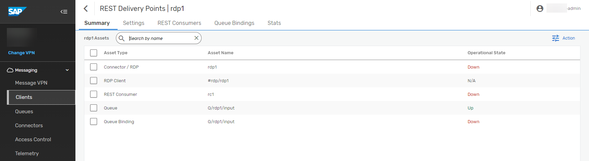