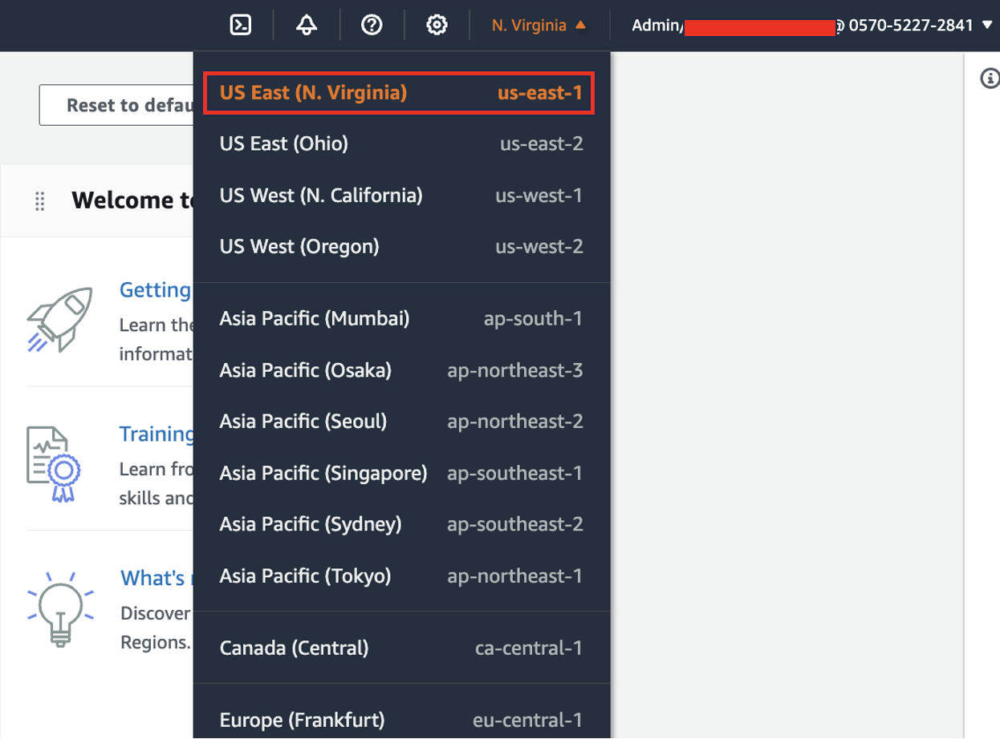

With Amazon Rekognition PPE detection, customers can analyze images from their on-premises cameras across all locations to automatically detect if persons in the images are wearing the required PPE such as face covers, hand covers, and head covers. SAP customers use SAP Environment health and safety module to record these detections manually as safety observations.This solution provides an integration framework between Amazon Rekogntion and SAP Envriroment, Health and Safety(EHS). This solution helps organizations achieve their sustainability goals for workplace safety by fostering employee well being and reducing environment impact. 
## Deploying the CDK Project

This project is set up like a standard Python project.  For an integrated development environment (IDE), use `SAP Business Application Studio` to create python virtual environment for the project with required dependencies.  


Under network settings, expand VPC settings and select the VPC created as part of [pre-requisites](VPCReadme.md).  
Leave other configurations as default and click **create**.


2.  Clone the github repository and navigate to the directory.

```
git clone https://github.com/ganeesin/ppedetection-ehs

cd ppedetection-ehs
```

To manually create a virtualenv 

```
python3 -m venv .env
```

After the init process completes and the virtualenv is created, you can use the following
step to activate your virtualenv.

```
source .env/bin/activate
```

Once the virtualenv is activated, you can install the required dependencies.

```
pip install -r requirements.txt
```

The `appConfig.json` file takes the input paramters for the stack. Maintain the following parameters in the `appConfig.json` before deploying the stack

## AWS environment details
* `account` Enter AWS account id of your AWS cloud environment
  Goto [AWS Console](https://us-east-1.console.aws.amazon.com/cloud9control/home?region=us-east-1#/product) and on the top right click on dropdown button as shown, Copy the Account ID as highlighted.
   
* `region`  Enter Region information where the stack resources needs to be created
  Goto [AWS Console](https://us-east-1.console.aws.amazon.com/cloud9control/home?region=us-east-1#/product) and on the top right click on dropdown as highlighted which shows the region, copy the region associated to your AWS Account(Example - us-east-1)
     
* `vpcId`   Enter the VPC for Lambda execution
  Goto [AWS Console](https://us-east-1.console.aws.amazon.com/cloud9control/home?region=us-east-1#/product) and type in "VPC" in the search tab->Click on VPC, you will see the list of all VPC's created in your AWS environment, select the VPC created as part of pre-requisite steps, Copy the vpcID as highlighted.
   
* `subnet`  Enter the subnet ID for Lambda exection
  Goto [AWS Console](https://us-east-1.console.aws.amazon.com/cloud9control/home?region=us-east-1#/product)and type in "Subnet" in the search tab->Click on Subnet, you will see the list of Subnet's created in your AWS environment, select the Private Subnet created as part of pre-requisite steps, Copy the SubnetID as highlighted below
*  Note: Please provide a private subnet for the lambda execution.
   
## Resource Identifiers
* `stackname` Enter an Identifier/Name for the CDK stack
## Bucket Structure
* `bucketname` Enter the name of the bucket to be created where the images will be captured for analysis 
## SAP Environnment details
* `SAP_AUTH_SECRET` Provide the arn where the credentials with keys `user` and `password` or `APIkey` if using SAP BTP  for accessing SAP services.
* `SAP_HOST_NAME` Host name of the instance for accessing the SAP OData service e.g. hostname of load balancer/Web Dispatcher/SAP Gateway. If using BTP, please pass host alias
* `SAP_PORT` provide the port on which the SAP service can be accesed e.g 443/50001
* `SAP_PROTOCOL` Enter protocol ushing which the service will be accessed HTTPS/HTTP 
* `SAP_AUTH_SECRET` Enter ARN of secrets manager holding the APIKey. 

Bootstrap your AWS account for CDK. Please check [here](https://docs.aws.amazon.com/cdk/latest/guide/tools.html) for more details on bootstraping for CDK. Bootstraping deploys a CDK toolkit stack to your account and creates a S3 bucket for storing various artifacts. You incur any charges for what the AWS CDK stores in the bucket. Because the AWS CDK does not remove any objects from the bucket, the bucket can accumulate objects as you use the AWS CDK. You can get rid of the bucket by deleting the CDKToolkit stack from your account.

```
cdk bootstrap aws://<YOUR ACCOUNT ID>/<YOUR AWS REGION>
```

Deploy the stack to your account. Make sure your CLI is setup for account ID and region provided in the appConfig.json file.

```
cdk deploy
```

## Cleanup

In order to delete all resources created by this CDK app, Follow this [tutorial](CleanupReadme.md) .

## Useful commands

 * `cdk ls`          list all stacks in the app
 * `cdk synth`       emits the synthesized CloudFormation template
 * `cdk deploy`      deploy this stack to your default AWS account/region
 * `cdk diff`        compare deployed stack with current state
 * `cdk docs`        open CDK documentation

