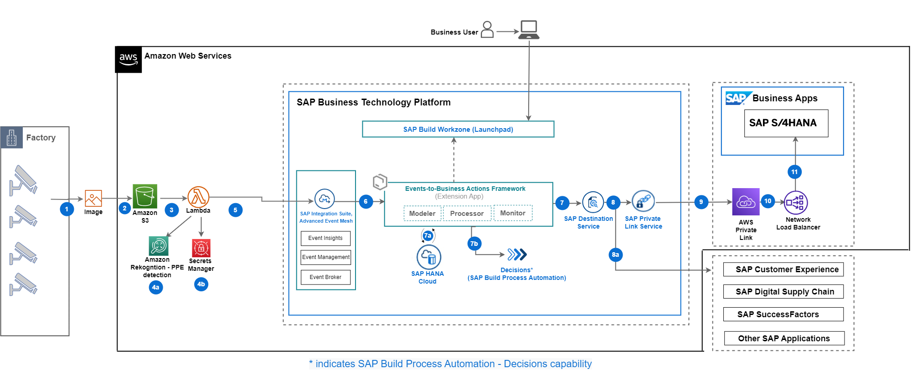

## Integrating Amazon Rekogntion - PPE detection and SAP Environment, health and Safety - Sustainability

This repository contains code samples and instructions for developing an extension application in SAP BTP. The sample application has been developed in a partner collaboration to help customers integrate any type of events from systems into SAP ecosystem via SAP BTP. This application helps to configure actions that needs to be taken in SAP LoB systems based on the events that is received in SAP Advanced Event Mesh. The application scenario you will develop in this tutorial leverages Event-To-Business actions framework (extension application).

This framework can be used in combination with any hyperscalar/telco IoT.

 In this tutorial, the **events** are received from **Amazon Rekognition - PPE Detection** and the **actions** for these events are taken in **SAP S/4HANA**. You can use this application to further customize it for other systems as well.

 ## Scenario

Safety hazards can exist in every workplace in many different forms: sharp edges, falling objects, flying sparks, chemicals, noise, and other potentially dangerous situations. Safety regulators such as Occupational Safety and Health Administration (OSHA) and European Commission often require that businesses protect their employees and customers from hazards that can cause injury by providing them personal protective equipment (PPE) and ensuring their use.With Amazon Rekognition PPE detection, customers can analyze images from their on-premises cameras across all locations to automatically detect if persons in the images are wearing the required PPE such as face covers, hand covers, and head covers. SAP customers use SAP Environment health and safety module to record these detections manually as safety observations.This solution provides an integration framework between Amazon Rekogntion and SAP Envriroment, Health and Safety(EHS).

## Solution Architecture

The key services used from **AWS** are Amazon Rekognition PPE Detection, Amazon S3, Amazon Lambda Function, AWS Secrets Manager. The services used from **SAP BTP** are the Cloud Foundry Runtime, SAP Advanced Event Mesh, SAP Connectivity service, SAP Private Link service, SAP Workflow Management and SAP Destination service.

SAP Private Link service is used for connectivity between SAP BTP and SAP S/4HANA when both the systems are running on Amazon AWS Infrastructure, in this tutorial you will find implementation steps for SAP BTP Private Link service and AWS Private Link service. Alternatively you can use SAP Connectivity service and Cloud Connector for integration of SAP BTP and SAP S/4HANA as well.

 **Figure-1: High-level architecture (with SAP S/4HANA on AWS)**

The following steps depicts the information flow across systems:

(1) Equipment (Camera): CCTV cameras at the factory capture images of people and location and pushes them to an Amazon S3 bucket.

(2) Amazon S3 holds the images for model inference. A lambda function can be scheduled or triggered to execute the inference. 

(3) The lambda function calls Amazon Rekognition PPE detection model to detect any visual inspection issues with the product.

(4) Amazon Rekogntion – PPE detection evaluated the image for any missing PPE equipment like Hand gloves, Face covers, Head gears and safety visors. if an anomaly is detected, The Lambda function accesses AWS secrets Manager for credential information for SAP BTP

(5) The lambda function calls the SAP Integration Suite, Advanced event mesh and passes the event payload. Event-to-Business-Action framework(extension app) processor module's endpoint is subscribed to SAP Advanced Event Mesh, hence receives this event.

(6) Event-to-Business-Action framework(extension app) processor module leverages the Business Rules capability of SAP Build Process Automation to derive business action (for example, In this scenario,**EHS Incident Report Safety Observation** creation in SAP S/4HANA system) based on certain characteristics of incoming event.

(7), (8), (9) (10) and (11) Event-to-Business-Action framework (extension app) processor module triggers the defined action in the SAP S/4HANA system by using the SAP Destination Service and SAP Private Link Service.

For more information, see Set Up Connectivity Between SAP BTP and SAP S/4HANA Using SAP Private Link Service page.

## Requirements

These are the technical prerequistics for an integration between AWS, SAP BTP and SAP S/4HANA. 

**Services in SAP BTP**
- Cloud Foundry Runtime
    > - Foundation for running the CAP extension application for translating events to business actions.

- Memory/Runtime quota
    > - Required for deploying and running the extension application in SAP BTP

- Authorization & Trust Management Service
    > - Required for securing the extension application in SAP BTP

- SAP Integration Suite,Advanced Event Mesh 
    >- Required to receive events from Amazon Monitron

- SAP HANA Cloud 
    >- Required to store action configuration and logs for CAP application

- SAP HANA Schemas & HDI Containers 
    >- Application database for CAP Application

- SAP Process Automation - Business Rules capability
    >- Business Rules service to configure business decisions that needs to be taken based on the type of event received from Amazon Monitron.

- SAP S/4HANA System
    >- To execute the business action associated with the event received. 

- SAP Connectivity Service
    >- To establish connections between cloud applications and on-premise systems.

- SAP Destination Service
    >- To find the destination information required to access a remote service or system from your extension application.

- SAP Private Link Service
    >- To establishe a private connection between selected SAP BTP services and selected services in your own IaaS provider accounts.

- SAP Business Application Studio
    >- A powerful and modern development environment, tailored for efficient development of business applications for the Intelligent Enterprise.

**Amazon Web Services**
- A valid AWS subscription

- Amazon Rekognition - PPE Detection
    > - Required for receiving and sending the events whenever an abnormality is detected in the equipment.

- Amazon S3
    > - Required to store the received streaming event data.

- Amazon Secrets Manager
    >- Required to store the Advanced Event Mesh credentials that are accessed by the Amazon Lambda Function.

- Amazon Lambda Function
    >- Required to orchestrate the process of detecting a stream contains any alerts related to failure or warnings, and then the inference result is passed to SAP Advanced Event Mesh.